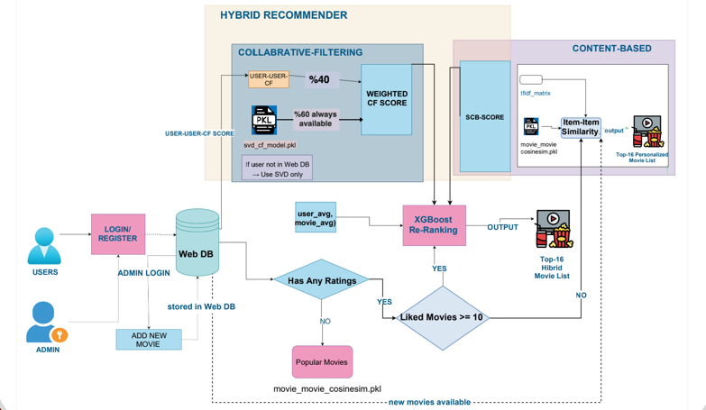
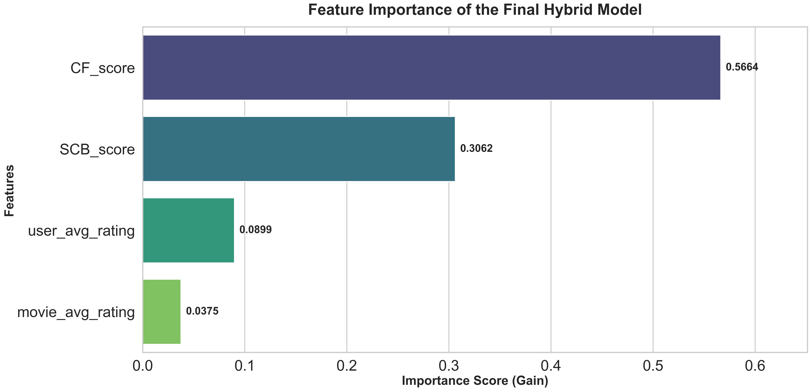

# 🎬 Hybrid Movie Recommendation System
**(Collaborative + Content-Based + XGBoost Re-Ranking)**


This repository contains a production-oriented **hybrid movie recommender system** developed on the **MovieLens 3M** dataset. The project combines data enrichment, content-based filtering, collaborative filtering, and learning-to-rank techniques, deployed as a Flask-based web application supporting real-time user interaction.

---

## Project Overview

The system is designed as a **two-phase architecture**:

1.  **Offline Phase:** Data enrichment, feature engineering, model training, and evaluation using Jupyter Notebooks.
2.  **Online Phase:** A Flask web application that loads pre-trained models and performs real-time inference, handling **cold-start users**, **active users**, and **admin-driven movie additions**.

**The main goal is to overcome:**
* Sparse user interactions.
* Cold-start problems.
* Static model limitations in live environments.

---

## 📊 Dataset

* **Source:** MovieLens 3M
* **Users:** 138,306
* **Movies:** 34,216
* **Ratings:** ~3,000,000
* **External Enrichment:** **TMDB API** is used to fetch missing keywords and metadata for movies with insufficient tags.

---

## System Architecture

The recommender integrates three complementary components:
1.  **Collaborative Filtering (CF)**
2.  **Semantic Content-Based Filtering (SCB)**
3.  **Hybrid Re-Ranking Model (XGBoost)**



---

## 1. Data Engineering & Enrichment

The system does not rely solely on the raw MovieLens dataset.

### 🔹 TMDB Enrichment
* Movies with missing metadata are enriched via **TMDB API**.
* Retrieved keywords are merged with movie titles, genres, and existing tags.

### 🔹 NLP Processing
* Text normalization (lowercasing, regex cleaning).
* Stopword removal.
* **Feature Extraction:** Used **TF-IDF Vectorizer (5,000 features)**.
* *Result:* Each movie is transformed into a semantic vector representation.

---

## 2. Model Training 

### Content-Based Filtering (SCB)
* **User Profile:** For each user, TF-IDF vectors of rated movies are weighted by normalized ratings to create a semantic user profile vector.
* **Similarity:** Calculated using Cosine similarity in TF-IDF space.

### Collaborative Filtering (CF – SVD)
* Standard **Matrix Factorization (SVD)** is trained on the user–item rating matrix.
* Captures latent user–movie interactions.
* **Export:** Saved as `svd_cf_model.pkl`.

### Hybrid Re-Ranking (XGBoost)
A learning-to-rank model is trained using the following features:

| Feature | Description |
| :--- | :--- |
| `SCB_score` | Content similarity score (User Profile vs Movie Vector) |
| `CF_score` | SVD-based collaborative score |
| `user_avg_rating` | User’s global average rating |
| `movie_avg_rating` | Movie’s global average rating |

* **Model:** XGBoost Regressor.
* **Output:** Final predicted rating.

---

## 3. Web Application & Online Workflow

The Flask web application is designed for real-time recommendation without retraining models for every interaction.

### New Users (Cold Start: <10 Ratings)
* Collaborative signals are unreliable for new users.
* **Strategy:** System uses **Content-Based Filtering only**.
* **Logic:** Recommendations are generated using TF-IDF cosine similarity based on the few movies the user has liked or selected genres.

### Active Users (≥10 Ratings)
A **web-specific hybrid logic** is applied:

#### A. Weighted Collaborative Score
Since the SVD model is static (offline) and web user data is sparse/dynamic:
> **CF_web = (0.60 × SVD_score) + (0.40 × User-User CF)**

* This dynamic memory-based component (User-User cosine_sim) compensates for the sparsity of live interactions.

#### B. Final Ranking
The following features are fed into the trained **XGBoost** model:
1.  Weighted CF score
2.  SCB score
3.  User average
4.  Movie average

**Output:** Top-K personalized movie recommendations.

---

## 4. Admin Panel & Dynamic Updates

Admins can add new movies via the web interface.
* **Workflow:**
    1.  Metadata is fetched from TMDB.
    2.  Text is processed and vectorized using the pre-trained TF-IDF model.
    3.  The movie is **immediately added** to the similarity space.
* **Benefit:** ✔ No retraining required. ✔ New movies become recommendable instantly.

---

## Evaluation & Results

### Rating Prediction Performance
| Model | RMSE | MAE |
| :--- | :--- | :--- |
| SVD (CF) | 0.885 | 0.677 |
| **Hybrid** | **0.866** | **0.663** |

### Top-K Recommendation Quality (K=10)
| Model | Precision@10 | HitRatio@10 | NDCG@10 |
| :--- | :--- | :--- | :--- |
| SVD (CF) | 0.269 | 0.493 | 0.289 |
| **Hybrid** | **0.270** | **0.505** | **0.315** |

> Feature importance analysis shows that CF and SCB scores dominate, validating the hybrid design.



---

## How to Run the Web Application (Local)

1.  **Clone Repository**
    ```bash
    git clone https://github.com/kambercansahin/hybrid-movie-recommender.git
    cd hybrid-movie-recommender
    ```

2.  **Create Virtual Environment**
    ```bash
    python -m venv .venv
    # Windows:
    .venv\Scripts\activate
    # Mac/Linux:
    source .venv/bin/activate
    ```

3.  **Install Dependencies**
    ```bash
    pip install -r requirements.txt
    ```

4.  **Run Flask App**
    ```bash
    cd app
    python main.py
    ```
    Open your browser at: `http://127.0.0.1:5000`

---

## 📁 Project Structure

```text
app/
├── static/
│   └── style.css
├── templates/
│   ├── admin.html
│   ├── index.html
│   ├── login.html
│   ├── movie.html
│   └── recs.html
├── auth.py
├── db.py
├── main.py
└── recommender.py
assets/
├── system_architecture.png
└── feature_important.png
Models/
├── Hybrid_recommender_MODEL.ipynb
├── links.csv
├── movies.csv
├── ratings.csv
└── tags.csv
saved_models/
├── movie_movie_cosine_sim.pkl
├── movie_to_index.pkl
├── svd_cf_model.pkl
├── tfidf_matrix.pkl
├── user_profiles_scb.pkl
└── xgb_hybrid_model.pkl
links.csv
movies.csv
ratings.csv
README.md
requirements.txt
